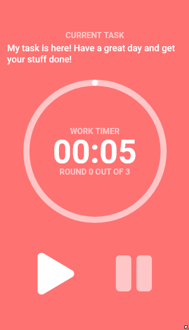

## Pomodoro timer
// Very first school project using js.  
Simple responsive pomodoro web application using vanilla javascript. Local storage is used to store tasks.  
[LIVE DEMO](https://devastion.github.io/pomodoro-timer/) (mobile view only)

